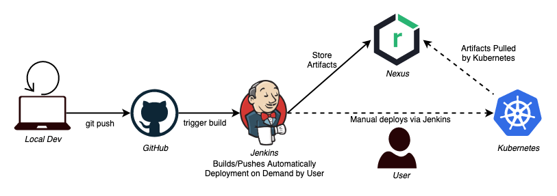
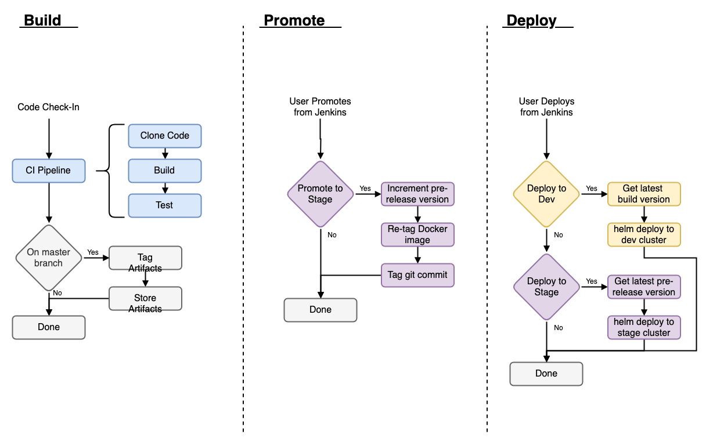

# User Guide
At a high level, Jenkins acts as a middle-man that takes code from GitHub, packages it to be stored as artifacts, and with manual intervention deploys those artifacts to Kubernetes.

The toolchain for this process is described in the diagram below.

This document will describe the workflow used by Jenkins and Dockhand.

For configuration related to specific components see these documents.
- [Repository](./repo-configuration.md)
- [Jenkins](./jenkins-configuration.md)
- [Kubernetes](./kubernetes-configuration.md)

## Workflow
The digram below describes the build, promote, and deploy workflow used for applications. More detail on these stages is listed below.

### Build
Docker images are built, promoted and deployed using Jenkins. An image is built when a new commit is created. This image is only tagged and stored in Nexus if the branch being built is one of the branches listed in the library config.yaml. This image is store with the tag `build-<commit_hash>` and can be deployed to the dev environment.

### Promote
Promotion takes an image that was built and tags it with a release candidate semantic version for promotions to stage, or a unadorned semantic version for promotions to production. Promotion will queue the image up to be deployed but will not itself cause a deployment. A promotion will also tag git commit with the tag that has been added to the image.

To run a promotion, navigate to the application's promotion pipeline and schedule a build on the appropriate branch. Select a promotion key of stage or prod to promote an image from dev to stage or from stage to prod respectively. The pipeline will wait for a confirmation dialog to be accepted before continuing with the promotion.

### Deploy
Deployments can be run against the dev and the stage cluster (no production cluster yet exists). A deployment takes the latest tag and uses it when deploying the helm chart stored in the repository. For deployments to dev the latest tag will be the most recent `build-<commit_hash>`, for stage the latest tag will be of the form `<major.minor.patch>-rc#`.

To run a deployment, navigate to the application's deployment pipeline and schedule a build on the appropriate branch. Select the target environment as the deploymentKey and run the task.
